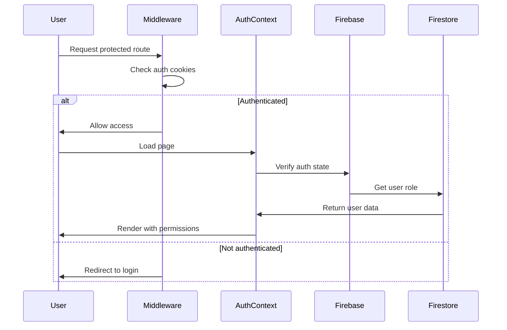

# 🔒 MomentoCake Admin Security Implementation

## Overview

This document outlines the security implementation for the MomentoCake Admin system, including authentication, authorization, data protection, and best practices.

## 🚨 Critical Security Fixes Implemented

### 1. **Next.js Middleware Authentication**
- **File**: `src/middleware.ts`
- **Purpose**: Server-side route protection
- **Features**:
  - Automatic authentication checking
  - Role-based access control
  - Redirect handling for unauthorized access
  - Public route exemptions

### 2. **Enhanced AuthContext**
- **File**: `src/contexts/AuthContext.tsx`
- **Purpose**: Centralized authentication state management
- **Features**:
  - Real Firebase authentication integration
  - Cookie-based session persistence
  - Automatic user role detection
  - Secure logout handling

### 3. **Route Protection**
- **Component**: `ProtectedRoute`
- **Layout**: Profile page now has dedicated protection layout
- **Features**:
  - Client-side authentication verification
  - Admin-only route restrictions
  - Loading state management
  - Automatic redirects

### 4. **Firebase Configuration Security**
- **File**: `src/lib/firebase.ts`
- **Features**:
  - Environment variable validation
  - Placeholder detection
  - Error handling with helpful messages
  - Development emulator support

### 5. **Enhanced Error Handling**
- **File**: `src/lib/firebase-errors.ts`
- **Features**:
  - Comprehensive error mapping
  - User-friendly error messages
  - Retry logic for transient errors
  - Security-aware logging

### 6. **Firebase Security Rules**
- **File**: `firestore.rules`
- **Features**:
  - Multi-tenant data isolation
  - Role-based access control
  - User profile protection
  - Business data segregation

## 🛡️ Security Architecture

### Authentication Flow



### Multi-Layer Protection

1. **Server-Side (Middleware)**
   - Route-level protection
   - Cookie validation
   - Role-based redirects

2. **Client-Side (AuthContext)**
   - Real-time auth state
   - User role management
   - Secure token handling

3. **Database (Firestore Rules)**
   - Document-level security
   - Business data isolation
   - Role-based permissions

4. **Application (Components)**
   - Conditional rendering
   - Feature-level permissions
   - Secure data handling

## 🔐 Role-Based Access Control (RBAC)

### User Roles

| Role | Permissions | Access Level |
|------|-------------|--------------|
| **admin** | Full system access | All routes, all data |
| **viewer** | Read-only access | Dashboard, reports (read-only) |

### Route Protection Matrix

| Route | Public | Viewer | Admin | Notes |
|-------|--------|--------|-------|-------|
| `/` | ✅ | ✅ | ✅ | Landing page |
| `/login` | ✅ | ✅ | ✅ | Authentication |
| `/setup` | ✅ | ❌ | ❌ | Initial admin setup only |
| `/dashboard` | ❌ | ✅ | ✅ | Main dashboard |
| `/profile` | ❌ | ✅ | ✅ | User profile management |
| `/users` | ❌ | ❌ | ✅ | Admin only - user management |
| `/settings` | ❌ | ❌ | ✅ | Admin only - system settings |
| All others | ❌ | ✅ | ✅ | Business data access |

## 🔥 Firebase Security Configuration

### Environment Variables

**Required Variables** (must be set in `.env.local`):

```env
NEXT_PUBLIC_FIREBASE_API_KEY=your-actual-api-key
NEXT_PUBLIC_FIREBASE_AUTH_DOMAIN=your-project.firebaseapp.com
NEXT_PUBLIC_FIREBASE_PROJECT_ID=your-project-id
NEXT_PUBLIC_FIREBASE_STORAGE_BUCKET=your-project.appspot.com
NEXT_PUBLIC_FIREBASE_MESSAGING_SENDER_ID=your-sender-id
NEXT_PUBLIC_FIREBASE_APP_ID=your-app-id

# Optional - for emulator usage
NEXT_PUBLIC_USE_FIREBASE_EMULATOR=false
```

### Firestore Security Rules

**Key Security Features**:

1. **Authentication Required**: All operations require valid authentication
2. **Role Verification**: User roles validated against Firestore documents
3. **Active User Check**: Only active users can access data
4. **Multi-Tenant Isolation**: Business data isolated by business ID
5. **Admin Privilege Escalation**: Only admins can modify user roles
6. **Audit Trail Protection**: System logs protected from direct modification

**Rule Highlights**:

```javascript
// Only admins can create/delete users
allow create, delete: if isAdmin();

// Users can update own profile, but not role/status
allow update: if isOwnerOrAdmin(userId) && 
              (isAdmin() || 
               (!('role' in request.resource.data.diff(resource.data).affectedKeys()) &&
                !('isActive' in request.resource.data.diff(resource.data).affectedKeys())));

// Business data isolation
allow read, write: if isAdmin() || hasBusinessAccess(businessId);
```

## 🚨 Security Best Practices

### 1. **Environment Configuration**

- **Never commit** `.env.local` to version control
- **Validate** all environment variables on startup
- **Use different** Firebase projects for dev/staging/production
- **Regularly rotate** API keys and credentials

### 2. **Authentication Security**

```typescript
// ✅ Good - Proper error handling
try {
  await signInWithEmailAndPassword(auth, email, password)
} catch (error) {
  const errorInfo = handleFirebaseError(error)
  // Handle based on error severity and retry logic
}

// ❌ Bad - Exposing sensitive errors
catch (error) {
  console.log(error) // Don't expose raw Firebase errors
  alert(error.message) // Never show technical errors to users
}
```

### 3. **Data Access Patterns**

```typescript
// ✅ Good - Check permissions before operations
const { isPlatformAdmin } = useAuth()

if (!isPlatformAdmin()) {
  throw new Error('Insufficient permissions')
}

// ❌ Bad - Assuming client-side checks are enough
// Client-side only checks can be bypassed
```

### 4. **Error Handling**

```typescript
// ✅ Good - Use centralized error handling
import { logFirebaseError, handleFirebaseError } from '@/lib/firebase-errors'

try {
  await firestoreOperation()
} catch (error) {
  const errorInfo = logFirebaseError(error, 'user-profile-update')
  setError(errorInfo.userMessage)
}
```

## 🔍 Security Monitoring

### Development Monitoring

- Firebase errors logged to console with context
- Environment variable validation on startup
- Placeholder detection warnings
- Authentication state changes tracked

### Production Monitoring (Recommended)

- **Error Tracking**: Integrate Sentry or similar service
- **Performance Monitoring**: Firebase Performance Monitoring
- **Security Monitoring**: Cloud Functions for audit logging
- **Access Logging**: Track admin actions and data access

## 🚀 Deployment Security Checklist

### Before Deployment

- [ ] All environment variables configured with real values
- [ ] Firebase security rules deployed and tested
- [ ] Authentication flow tested end-to-end
- [ ] Role-based access control verified
- [ ] Error handling tested with various scenarios
- [ ] Multi-tenant data isolation verified
- [ ] Admin controls tested
- [ ] Profile page protection verified

### After Deployment

- [ ] Firebase console access restricted
- [ ] Admin user accounts created
- [ ] Security rules deployed
- [ ] Error monitoring configured
- [ ] Performance monitoring enabled
- [ ] Backup strategy implemented
- [ ] Access logs reviewed

## 🔧 Troubleshooting Common Issues

### Firebase Configuration Errors

**Issue**: "Firebase not initialized" or "Missing environment variables"

**Solution**:
1. Check `.env.local` exists and contains all required variables
2. Ensure variables don't contain placeholder values
3. Restart development server after env changes
4. Verify Firebase project settings match env values

### Authentication Errors

**Issue**: "User not authenticated" or infinite loading

**Solution**:
1. Check Firebase Auth configuration
2. Verify user exists in Firestore `/users` collection
3. Confirm user account is active (`isActive: true`)
4. Check browser cookies are enabled
5. Clear browser cache and cookies

### Permission Errors

**Issue**: "Permission denied" in Firestore operations

**Solution**:
1. Verify Firestore security rules are deployed
2. Check user role in Firestore document
3. Confirm user account is active
4. Test with Firebase emulator for debugging
5. Check browser network tab for actual error messages

### Route Protection Issues

**Issue**: Protected pages accessible without authentication

**Solution**:
1. Verify middleware is configured correctly
2. Check auth cookies are being set
3. Confirm protected routes are listed in middleware
4. Test authentication flow end-to-end
5. Check browser developer tools for middleware execution

## 📞 Security Support

For security-related issues or questions:

1. **Development Issues**: Check browser console and Firebase logs
2. **Production Issues**: Review error monitoring dashboard
3. **Security Concerns**: Follow responsible disclosure process
4. **Configuration Help**: Reference Firebase documentation

---

**Last Updated**: August 2025  
**Security Review**: Recommended every 3 months